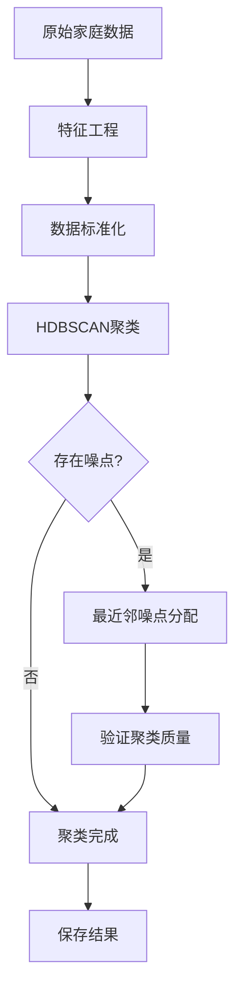

# HDBSCAN家庭聚类算法 + 最近邻噪点处理

## 算法概述

本算法使用HDBSCAN进行家庭聚类，并通过最近邻方法处理噪点，确保每个家庭都有聚类标签，适用于DiT生成模型的条件输入。

## 算法流程



## 完整代码实现

```python
import pandas as pd
import numpy as np
from sklearn.preprocessing import StandardScaler
from sklearn.neighbors import NearestNeighbors
from sklearn.metrics import silhouette_score, calinski_harabasz_score
import hdbscan
import matplotlib.pyplot as plt
import seaborn as sns
from collections import Counter

class FamilyClusteringWithHDBSCAN:
    def __init__(self, min_cluster_size=100, min_samples=20, metric='euclidean'):
        """
        初始化HDBSCAN聚类器
        
        Parameters:
        -----------
        min_cluster_size : int, default=100
            最小聚类大小，控制聚类的粗细程度
        min_samples : int, default=20
            核心样本的最小邻居数
        metric : str, default='euclidean'
            距离度量方式
        """
        self.min_cluster_size = min_cluster_size
        self.min_samples = min_samples
        self.metric = metric
        self.clusterer = None
        self.scaler = StandardScaler()
        self.cluster_labels_ = None
        self.noise_count_ = 0
        
    def feature_engineering(self, family_df):
        """
        特征工程：基于现有数据创建新特征
        
        Parameters:
        -----------
        family_df : DataFrame
            原始家庭数据
            
        Returns:
        --------
        DataFrame : 处理后的特征数据
        """
        features_df = family_df.copy()
        
        # 创建组合特征
        features_df['交通工具总数'] = (
            features_df['机动车数量'] + features_df['脚踏自行车数量'] + 
            features_df['电动自行车数量'] + features_df['摩托车数量'] + 
            features_df['老年代步车数量']
        )
        
        # 人均交通工具数（避免除零）
        features_df['人均交通工具数'] = features_df['交通工具总数'] / np.maximum(features_df['家庭成员数量'], 1)
        
        # 工作人口比例
        features_df['工作人口比例'] = features_df['家庭工作人口数'] / np.maximum(features_df['家庭成员数量'], 1)
        
        # 收入水平分档（基于现有编码）
        features_df['收入等级'] = pd.cut(features_df['家庭年收入_encoded'], 
                                    bins=[0, 2, 5, 7, 10], 
                                    labels=['低收入', '中低收入', '中高收入', '高收入'])
        features_df['收入等级_encoded'] = features_df['收入等级'].cat.codes
        
        # 家庭规模分类
        def classify_family_size(size):
            if size == 1:
                return 0  # 单人家庭
            elif size == 2:
                return 1  # 小家庭
            elif size <= 4:
                return 2  # 中等家庭
            else:
                return 3  # 大家庭
        
        features_df['家庭规模类型'] = features_df['家庭成员数量'].apply(classify_family_size)
        
        # 年龄分组
        def classify_family_age(age):
            if age < 35:
                return 0  # 年轻家庭
            elif age < 50:
                return 1  # 中年家庭
            elif age < 65:
                return 2  # 成熟家庭
            else:
                return 3  # 老年家庭
        
        features_df['家庭年龄组'] = features_df['家庭平均年龄'].apply(classify_family_age)
        
        return features_df
    
    def prepare_features(self, features_df):
        """
        准备用于聚类的特征矩阵
        
        Parameters:
        -----------
        features_df : DataFrame
            特征工程后的数据
            
        Returns:
        --------
        ndarray : 标准化后的特征矩阵
        list : 特征列名
        """
        # 选择数值型特征进行聚类
        feature_columns = [
            '家庭成员数量', '家庭工作人口数', '机动车数量', '脚踏自行车数量', 
            '电动自行车数量', '摩托车数量', '老年代步车数量', '家庭平均年龄',
            '家庭年收入_encoded', 'have_student', '交通工具总数', '人均交通工具数',
            '工作人口比例', '收入等级_encoded', '家庭规模类型', '家庭年龄组'
        ]
        
        # 确保所有特征列都存在
        available_features = [col for col in feature_columns if col in features_df.columns]
        print(f"使用特征: {available_features}")
        
        # 提取特征矩阵
        X = features_df[available_features].astype(float)
        
        # 处理缺失值
        X = X.fillna(X.median())
        
        # 标准化
        X_scaled = self.scaler.fit_transform(X)
        
        return X_scaled, available_features
    
    def fit_hdbscan(self, X_scaled):
        """
        执行HDBSCAN聚类
        
        Parameters:
        -----------
        X_scaled : ndarray
            标准化后的特征矩阵
            
        Returns:
        --------
        ndarray : 聚类标签（包含噪点标签-1）
        """
        print("开始HDBSCAN聚类...")
        print(f"参数设置: min_cluster_size={self.min_cluster_size}, min_samples={self.min_samples}")
        
        # 创建HDBSCAN聚类器
        self.clusterer = hdbscan.HDBSCAN(
            min_cluster_size=self.min_cluster_size,
            min_samples=self.min_samples,
            metric=self.metric,
            cluster_selection_method='eom',  # 使用EOM方法选择聚类
            allow_single_cluster=False
        )
        
        # 执行聚类
        cluster_labels = self.clusterer.fit_predict(X_scaled)
        
        # 统计聚类结果
        unique_labels = np.unique(cluster_labels)
        n_clusters = len(unique_labels) - (1 if -1 in unique_labels else 0)
        n_noise = list(cluster_labels).count(-1)
        
        print(f"聚类完成:")
        print(f"  - 发现聚类数量: {n_clusters}")
        print(f"  - 噪声点数量: {n_noise} ({n_noise/len(cluster_labels)*100:.2f}%)")
        
        self.noise_count_ = n_noise
        return cluster_labels
    
    def assign_noise_points(self, X_scaled, cluster_labels, k_neighbors=5):
        """
        使用最近邻方法为噪点分配聚类标签
        
        Parameters:
        -----------
        X_scaled : ndarray
            标准化后的特征矩阵
        cluster_labels : ndarray
            包含噪点的聚类标签
        k_neighbors : int, default=5
            考虑的最近邻数量
            
        Returns:
        --------
        ndarray : 处理噪点后的聚类标签
        """
        if self.noise_count_ == 0:
            print("无噪点需要处理")
            return cluster_labels
        
        print(f"开始处理 {self.noise_count_} 个噪点...")
        
        # 复制标签数组
        final_labels = cluster_labels.copy()
        
        # 识别噪点和非噪点
        noise_mask = cluster_labels == -1
        clean_mask = ~noise_mask
        
        if clean_mask.sum() == 0:
            raise ValueError("所有点都是噪点，无法进行最近邻分配！")
        
        # 构建最近邻模型（仅使用非噪点）
        nn = NearestNeighbors(n_neighbors=min(k_neighbors, clean_mask.sum()))
        nn.fit(X_scaled[clean_mask])
        
        # 为每个噪点找到最近邻
        noise_points = X_scaled[noise_mask]
        distances, indices = nn.kneighbors(noise_points)
        
        # 获取非噪点的标签
        clean_labels = cluster_labels[clean_mask]
        
        # 为每个噪点分配标签
        assigned_count = 0
        for i, noise_idx in enumerate(np.where(noise_mask)[0]):
            # 获取最近邻的标签
            neighbor_labels = clean_labels[indices[i]]
            
            # 使用加权投票（距离越近权重越大）
            weights = 1 / (distances[i] + 1e-8)  # 避免除零
            
            # 计算加权投票
            unique_labels = np.unique(neighbor_labels)
            weighted_votes = {}
            
            for label in unique_labels:
                mask = neighbor_labels == label
                weighted_votes[label] = weights[mask].sum()
            
            # 选择权重最大的标签
            best_label = max(weighted_votes.keys(), key=weighted_votes.get)
            final_labels[noise_idx] = best_label
            assigned_count += 1
        
        print(f"噪点处理完成，成功分配 {assigned_count} 个噪点")
        
        return final_labels
    
    def evaluate_clustering(self, X_scaled, cluster_labels):
        """
        评估聚类质量
        
        Parameters:
        -----------
        X_scaled : ndarray
            标准化后的特征矩阵
        cluster_labels : ndarray
            聚类标签
            
        Returns:
        --------
        dict : 评估指标
        """
        # 排除噪点计算评估指标
        valid_mask = cluster_labels >= 0
        if valid_mask.sum() < 2:
            return {"error": "有效聚类点太少，无法评估"}
        
        X_valid = X_scaled[valid_mask]
        labels_valid = cluster_labels[valid_mask]
        
        # 如果只有一个聚类，无法计算轮廓系数
        if len(np.unique(labels_valid)) < 2:
            return {"error": "聚类数量太少，无法评估"}
        
        try:
            silhouette = silhouette_score(X_valid, labels_valid)
            calinski_harabasz = calinski_harabasz_score(X_valid, labels_valid)
            
            # 聚类分布统计
            cluster_counts = Counter(cluster_labels[cluster_labels >= 0])
            
            metrics = {
                "silhouette_score": silhouette,
                "calinski_harabasz_score": calinski_harabasz,
                "n_clusters": len(cluster_counts),
                "cluster_distribution": dict(cluster_counts),
                "min_cluster_size": min(cluster_counts.values()) if cluster_counts else 0,
                "max_cluster_size": max(cluster_counts.values()) if cluster_counts else 0,
                "noise_ratio": self.noise_count_ / len(cluster_labels)
            }
            
            return metrics
            
        except Exception as e:
            return {"error": f"评估失败: {str(e)}"}
    
    def fit_predict(self, family_df):
        """
        完整的聚类流程
        
        Parameters:
        -----------
        family_df : DataFrame
            原始家庭数据
            
        Returns:
        --------
        ndarray : 最终聚类标签
        dict : 聚类评估结果
        """
        print("=== 开始家庭聚类分析 ===")
        
        # 1. 特征工程
        print("\n1. 特征工程...")
        features_df = self.feature_engineering(family_df)
        
        # 2. 准备特征矩阵
        print("\n2. 准备特征矩阵...")
        X_scaled, feature_names = self.prepare_features(features_df)
        print(f"特征矩阵形状: {X_scaled.shape}")
        
        # 3. HDBSCAN聚类
        print("\n3. 执行HDBSCAN聚类...")
        cluster_labels = self.fit_hdbscan(X_scaled)
        
        # 4. 处理噪点
        print("\n4. 处理噪点...")
        final_labels = self.assign_noise_points(X_scaled, cluster_labels)
        
        # 5. 评估聚类质量
        print("\n5. 评估聚类质量...")
        evaluation = self.evaluate_clustering(X_scaled, final_labels)
        
        # 保存结果
        self.cluster_labels_ = final_labels
        self.features_df_ = features_df
        self.X_scaled_ = X_scaled
        self.feature_names_ = feature_names
        
        print("\n=== 聚类分析完成 ===")
        return final_labels, evaluation
    
    def plot_cluster_analysis(self, figsize=(15, 10)):
        """
        可视化聚类结果
        
        Parameters:
        -----------
        figsize : tuple, default=(15, 10)
            图片大小
        """
        if self.cluster_labels_ is None:
            raise ValueError("请先执行聚类分析")
        
        fig, axes = plt.subplots(2, 3, figsize=figsize)
        fig.suptitle('家庭聚类分析结果', fontsize=16, fontweight='bold')
        
        # 1. 聚类分布
        ax1 = axes[0, 0]
        cluster_counts = pd.Series(self.cluster_labels_).value_counts().sort_index()
        cluster_counts.plot(kind='bar', ax=ax1, color='skyblue')
        ax1.set_title('聚类分布')
        ax1.set_xlabel('聚类标签')
        ax1.set_ylabel('家庭数量')
        ax1.tick_params(axis='x', rotation=45)
        
        # 2. 家庭成员数量分布
        ax2 = axes[0, 1]
        for cluster in np.unique(self.cluster_labels_):
            mask = self.cluster_labels_ == cluster
            data = self.features_df_.loc[mask, '家庭成员数量']
            ax2.hist(data, alpha=0.6, label=f'聚类{cluster}', bins=8)
        ax2.set_title('各聚类家庭成员数量分布')
        ax2.set_xlabel('家庭成员数量')
        ax2.set_ylabel('频次')
        ax2.legend()
        
        # 3. 平均年龄vs收入水平
        ax3 = axes[0, 2]
        scatter = ax3.scatter(self.features_df_['家庭平均年龄'], 
                             self.features_df_['家庭年收入_encoded'],
                             c=self.cluster_labels_, cmap='tab10', alpha=0.6)
        ax3.set_title('家庭平均年龄 vs 收入水平')
        ax3.set_xlabel('家庭平均年龄')
        ax3.set_ylabel('收入编码')
        plt.colorbar(scatter, ax=ax3, label='聚类')
        
        # 4. 交通工具总数分布
        ax4 = axes[1, 0]
        cluster_transport = self.features_df_.groupby(self.cluster_labels_)['交通工具总数'].mean()
        cluster_transport.plot(kind='bar', ax=ax4, color='lightgreen')
        ax4.set_title('各聚类平均交通工具数量')
        ax4.set_xlabel('聚类标签')
        ax4.set_ylabel('平均交通工具数量')
        ax4.tick_params(axis='x', rotation=45)
        
        # 5. 工作人口比例
        ax5 = axes[1, 1]
        cluster_work_ratio = self.features_df_.groupby(self.cluster_labels_)['工作人口比例'].mean()
        cluster_work_ratio.plot(kind='bar', ax=ax5, color='orange')
        ax5.set_title('各聚类平均工作人口比例')
        ax5.set_xlabel('聚类标签')
        ax5.set_ylabel('工作人口比例')
        ax5.tick_params(axis='x', rotation=45)
        
        # 6. 学生家庭比例
        ax6 = axes[1, 2]
        cluster_student_ratio = self.features_df_.groupby(self.cluster_labels_)['have_student'].mean()
        cluster_student_ratio.plot(kind='bar', ax=ax6, color='pink')
        ax6.set_title('各聚类学生家庭比例')
        ax6.set_xlabel('聚类标签')
        ax6.set_ylabel('学生家庭比例')
        ax6.tick_params(axis='x', rotation=45)
        
        plt.tight_layout()
        plt.show()
    
    def get_cluster_profiles(self):
        """
        获取各聚类的特征画像
        
        Returns:
        --------
        DataFrame : 聚类特征统计
        """
        if self.cluster_labels_ is None:
            raise ValueError("请先执行聚类分析")
        
        # 计算各聚类的统计特征
        profile_features = [
            '家庭成员数量', '家庭工作人口数', '机动车数量', '家庭平均年龄',
            '家庭年收入_encoded', 'have_student', '交通工具总数', '工作人口比例'
        ]
        
        profiles = []
        for cluster in np.unique(self.cluster_labels_):
            mask = self.cluster_labels_ == cluster
            cluster_data = self.features_df_[mask]
            
            profile = {
                '聚类标签': cluster,
                '家庭数量': mask.sum(),
                '占比': f"{mask.sum()/len(self.cluster_labels_)*100:.1f}%"
            }
            
            for feature in profile_features:
                if feature in cluster_data.columns:
                    profile[f'{feature}_均值'] = cluster_data[feature].mean()
                    profile[f'{feature}_中位数'] = cluster_data[feature].median()
            
            profiles.append(profile)
        
        return pd.DataFrame(profiles)

# 使用示例
def run_family_clustering_analysis(family_data_path):
    """
    运行完整的家庭聚类分析
    
    Parameters:
    -----------
    family_data_path : str
        家庭数据文件路径
    """
    # 加载数据
    print("加载家庭数据...")
    family_df = pd.read_csv(family_data_path)
    
    # 创建聚类器
    clusterer = FamilyClusteringWithHDBSCAN(
        min_cluster_size=100,  # 最小聚类大小
        min_samples=20,        # 最小样本数
        metric='euclidean'     # 距离度量
    )
    
    # 执行聚类
    cluster_labels, evaluation = clusterer.fit_predict(family_df)
    
    # 打印评估结果
    print("\n=== 聚类评估结果 ===")
    for key, value in evaluation.items():
        if key != "cluster_distribution":
            print(f"{key}: {value}")
    
    # 打印聚类分布
    if "cluster_distribution" in evaluation:
        print("\n聚类分布:")
        for cluster, count in sorted(evaluation["cluster_distribution"].items()):
            print(f"  聚类 {cluster}: {count} 个家庭")
    
    # 获取聚类画像
    profiles = clusterer.get_cluster_profiles()
    print("\n=== 聚类特征画像 ===")
    print(profiles)
    
    # 可视化结果
    clusterer.plot_cluster_analysis()
    
    # 保存结果
    family_df['cluster'] = cluster_labels
    output_path = family_data_path.replace('.csv', '_clustered.csv')
    family_df.to_csv(output_path, index=False)
    print(f"\n聚类结果已保存至: {output_path}")
    
    return cluster_labels, evaluation, profiles

if __name__ == "__main__":
    # 使用你的数据文件路径
    data_path = "数据/family_cluster.csv"  # 替换为你的实际文件路径
    
    # 运行聚类分析
    labels, eval_results, cluster_profiles = run_family_clustering_analysis(data_path)
```

## 算法参数说明

### HDBSCAN关键参数
- **min_cluster_size**: 最小聚类大小，建议设为总样本数的0.3-1%
- **min_samples**: 核心点的最小邻居数，通常设为min_cluster_size的10-50%
- **metric**: 距离度量，推荐'euclidean'或'manhattan'

### 最近邻参数
- **k_neighbors**: 考虑的邻居数量，建议3-10
- **权重策略**: 使用距离倒数作为权重，距离越近权重越大

## 算法优势

1. **自动确定聚类数量**: 无需预设K值
2. **处理任意形状聚类**: 不假设球形分布
3. **噪点检测**: 自动识别异常样本
4. **稳定性好**: 对参数变化不敏感
5. **完整覆盖**: 确保每个家庭都有聚类标签

## 使用建议

1. **数据量大时**: 可适当增加min_cluster_size
2. **需要细分时**: 减小min_cluster_size和min_samples
3. **噪点太多时**: 检查特征工程和数据质量
4. **聚类效果不佳时**: 尝试不同的距离度量或特征组合

## 输出结果

- 聚类标签数组
- 聚类质量评估指标
- 各聚类特征画像
- 可视化分析图表
- 带标签的完整数据文件

这套算法确保了DiT模型训练时每个家庭都有明确的条件标签，为人口生成提供可靠的条件输入。